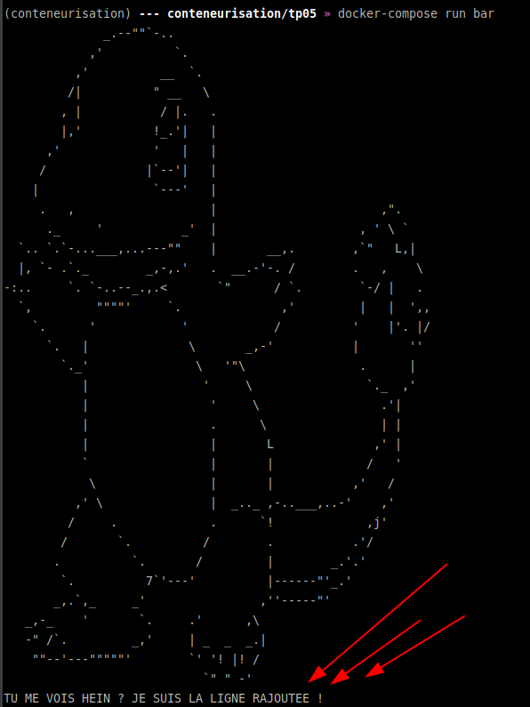

# Conteneurisation M2 TP05

## Initiation à Docker-compose

* [docker-compose.yml](docker-compose.yml)
* commands
```bash
(conteneurisation) --- conteneurisation/tp05 » docker run -it alpine-dev-motd:latest                     
              _.--""`-..
            ,'          `.
          ,'          __  `.
         /|          " __   \
        , |           / |.   .
        |,'          !_.'|   |
      ,'             '   |   |
     /              |`--'|   |
    |                `---'   |
     .   ,                   |                       ,".
      ._     '           _'  |                    , ' \ `
  `.. `.`-...___,...---""    |       __,.        ,`"   L,|
  |, `- .`._        _,-,.'   .  __.-'-. /        .   ,    \
-:..     `. `-..--_.,.<       `"      / `.        `-/ |   .
  `,         """"'     `.              ,'         |   |  ',,
    `.      '            '            /          '    |'. |/
      `.   |              \       _,-'           |       ''
        `._'               \   '"\                .      |
           |                '     \                `._  ,'
           |                 '     \                 .'|
           |                 .      \                | |
           |                 |       L              ,' |
           `                 |       |             /   '
            \                |       |           ,'   /
          ,' \               |  _.._ ,-..___,..-'    ,'
         /     .             .      `!             ,j'
        /       `.          /        .           .'/
       .          `.       /         |        _.'.'
        `.          7`'---'          |------"'_.'
       _,.`,_     _'                ,''-----"'
   _,-_    '       `.     .'      ,\
   -" /`.         _,'     | _  _  _.|
    ""--'---"""""'        `' '! |! /
                            `" " -' 
(conteneurisation) --- conteneurisation/tp05 » docker-compose run bar                                                
              _.--""`-..
            ,'          `.
          ,'          __  `.
         /|          " __   \
        , |           / |.   .
        |,'          !_.'|   |
      ,'             '   |   |
     /              |`--'|   |
    |                `---'   |
     .   ,                   |                       ,".
      ._     '           _'  |                    , ' \ `
  `.. `.`-...___,...---""    |       __,.        ,`"   L,|
  |, `- .`._        _,-,.'   .  __.-'-. /        .   ,    \
-:..     `. `-..--_.,.<       `"      / `.        `-/ |   .
  `,         """"'     `.              ,'         |   |  ',,
    `.      '            '            /          '    |'. |/
      `.   |              \       _,-'           |       ''
        `._'               \   '"\                .      |
           |                '     \                `._  ,'
           |                 '     \                 .'|
           |                 .      \                | |
           |                 |       L              ,' |
           `                 |       |             /   '
            \                |       |           ,'   /
          ,' \               |  _.._ ,-..___,..-'    ,'
         /     .             .      `!             ,j'
        /       `.          /        .           .'/
       .          `.       /         |        _.'.'
        `.          7`'---'          |------"'_.'
       _,.`,_     _'                ,''-----"'
   _,-_    '       `.     .'      ,\
   -" /`.         _,'     | _  _  _.|
    ""--'---"""""'        `' '! |! /
                            `" " -' 
TU ME VOIS HEIN ? JE SUIS LA LIGNE RAJOUTEE !
```
* proof

